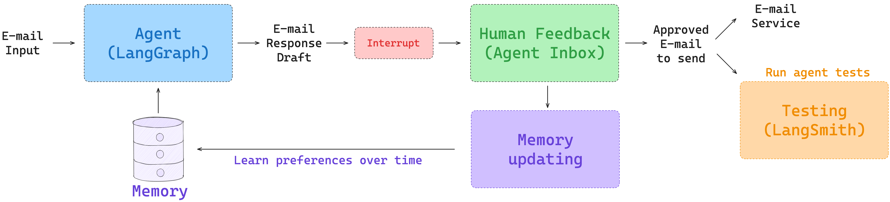
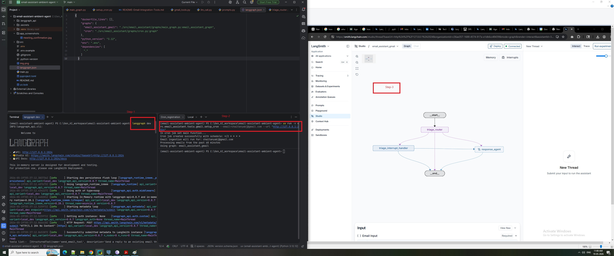
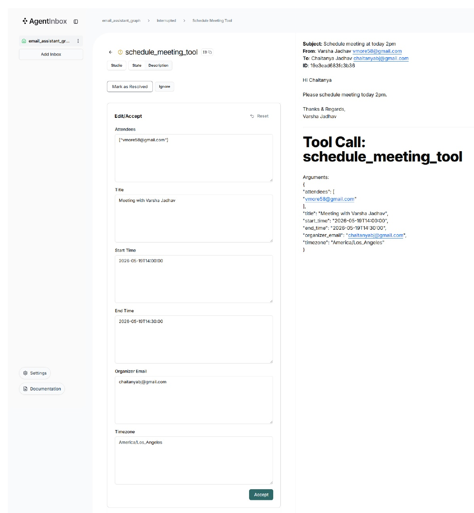
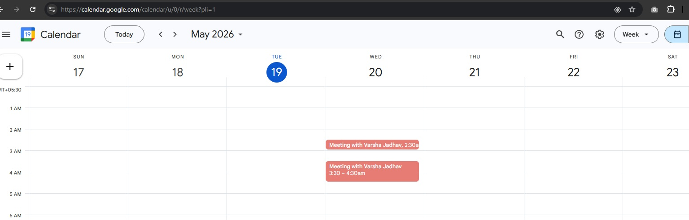

# Email Assistant — Ambient Agent

An **ambient agent** that quietly watches your Gmail inbox, decides what deserves attention, drafts replies, schedules meetings, and asks for your confirmation only when it matters. It learns from every edit, response, and "ignore" you give it.

Built on **LangGraph** with **OpenAI GPT-4.1**, persisted in **PostgreSQL**, and reviewed through **Agent Inbox** (https://dev.agentinbox.ai/).



---

## Why "ambient"?

Most agents are reactive — you prompt them, they respond. An **ambient agent** runs in the background on external triggers (in this case, new email) and only surfaces to a human when its confidence is low or its action is high-impact. The three principles this project follows:

1. **Triage before acting** — most email is noise. A classifier decides `ignore` / `notify` / `respond` *before* any drafting work happens, so the expensive LLM loop only runs on emails that warrant it.
2. **Human-in-the-loop (HITL) on side effects** — read-only tools (calendar lookups) run automatically. Anything that touches the world (`send_email`, `schedule_meeting`) or asks the user a direct `Question` is paused via `langgraph.types.interrupt()` and surfaced in Agent Inbox for `accept` / `edit` / `ignore` / `respond`.
3. **Long-term memory that learns from corrections** — every HITL action updates a JSON preference profile in Postgres (`triage_preferences`, `response_preferences`, `cal_preferences`). The next email is triaged and drafted against the *updated* profile, so the assistant gets more aligned with your style over time without being re-prompted.

---

## Tech stack

| Layer | Tech |
|---|---|
| Orchestration | LangGraph 1.2+, LangGraph CLI (`langgraph dev`) |
| LLM | OpenAI `gpt-4.1` via LangChain `init_chat_model` |
| Structured output | Pydantic schemas (`RouterSchema`, `UserPreferences`) |
| Memory & checkpointing | `langgraph-checkpoint-postgres` (`PostgresStore` + `PostgresSaver`) over a `psycopg_pool` connection pool |
| Email & calendar | Gmail API + Google Calendar API (`google-api-python-client`, `google-auth-oauthlib`) |
| HITL UI | Agent Inbox (https://dev.agentinbox.ai/) |
| Scheduling | LangGraph cron graph (`client.crons.create`) |
| Tracing (optional) | LangSmith |
| Runtime | Python 3.12, `uv` for dep management |

---

## Architecture

Two graphs are registered in [`langgraph.json`](langgraph.json):

- `email_assistant_gmail` — the per-email workflow ([`graphs/main_graph.py`](src/email_assistant/graphs/main_graph.py))
- `cron` — a wrapper graph for scheduled email ingestion ([`graphs/cron.py`](src/email_assistant/graphs/cron.py))

### Outer graph (per email)

```
START → triage_router ──┬─→ END                       (ignore)
                        ├─→ triage_interrupt_handler  (notify, raises interrupt)
                        └─→ response_agent            (respond)
```

- **`triage_router`** classifies via `llm_router` (structured output → `RouterSchema`). Reads `triage_preferences` from the store, falling back to `default_triage_instructions`.
- **`triage_interrupt_handler`** raises `interrupt()` so the user can review notify-classified emails in Agent Inbox.
- **`response_agent`** is the inner compiled subgraph below.

### Inner response agent

```
START → llm_call → should_continue ──┬─→ interrupt_handler ─→ llm_call (loop)
                                     └─→ mark_as_read_node  ─→ END
```

- **`llm_call`** invokes the LLM with tools bound and `tool_choice="required"`. Reads `response_preferences` + `cal_preferences` from the store and injects them into the system prompt.
- **`should_continue`** routes on the last tool call: `Done` → mark as read; anything else → HITL.
- **`interrupt_handler`** is the heart of the HITL loop:
  - Non-HITL tools (e.g. `check_calendar_tool`) execute directly.
  - HITL tools (`send_email_tool`, `schedule_meeting_tool`, `Question`) raise `interrupt(...)` with an Agent Inbox payload and wait for a response of type `accept` / `edit` / `ignore` / `respond`.
  - Each user action calls `update_memory(...)` against the appropriate namespace, so corrections are absorbed into the relevant preference profile.
- **`mark_as_read_node`** calls the Gmail API to mark the thread read on success.

### Cron / ingestion

`run_ingest.py` builds a Gmail search query from CLI flags, fetches matching threads, applies sender + latest-in-thread filters (unless `--skip-filters`), and pushes each email into the running LangGraph deployment via `langgraph_sdk`. `setup_cron.py` registers this same logic as a hosted cron via `client.crons.create("cron", schedule=..., input=...)`.

See [src/email_assistant/tools/gmail/README-Gmail-Integration-Tools.md](src/email_assistant/tools/gmail/README-Gmail-Integration-Tools.md) for the full filter semantics.

### Tools

Defined in [`tools/base.py`](src/email_assistant/tools/base.py) and [`tools/gmail/gmail_tools.py`](src/email_assistant/tools/gmail/gmail_tools.py):

| Tool | HITL? | Purpose |
|---|---|---|
| `send_email_tool` | yes | Send a reply via Gmail |
| `schedule_meeting_tool` | yes | Create a Google Calendar event |
| `check_calendar_tool` | no | Read availability (auto-executes) |
| `fetch_emails_tool` | no | Search Gmail |
| `Question` | yes | Ask the user for missing context |
| `Done` | no | Signal that the workflow is finished |

### Memory model

| Namespace | Drives | Updated when |
|---|---|---|
| `("email_assistant", "triage_preferences")` | `triage_router` classification rules | User ignores a draft → "don't treat this as respond" |
| `("email_assistant", "response_preferences")` | Email drafting style | User edits a sent email, or gives feedback |
| `("email_assistant", "cal_preferences")` | Meeting scheduling style | User edits a calendar invite, or gives feedback |

`update_memory` runs an LLM call with `MEMORY_UPDATE_INSTRUCTIONS` and a `UserPreferences` structured-output schema. It is instructed to make **targeted additions only** — never overwrite the whole profile.

---

## Repository layout

```
src/email_assistant/
├── graphs/
│   ├── main_graph.py            # outer graph + compiles inner response_agent
│   ├── cron.py                  # cron-schedulable ingestion graph
│   ├── nodes/
│   │   ├── triage_router.py     # classify email
│   │   ├── triage_interrupt_handler.py
│   │   ├── llm_call.py          # tool-using LLM loop
│   │   ├── interrupt_handler.py # HITL chokepoint + memory updates
│   │   └── mark_as_read.py
│   ├── routers/should_continue.py
│   └── states/state.py          # MainState, RouterSchema, UserPreferences
├── tools/
│   ├── base.py                  # get_tools / Done / Question
│   └── gmail/
│       ├── gmail_tools.py       # send/fetch/calendar tools
│       ├── setup_gmail.py       # OAuth flow → token.json
│       ├── run_ingest.py        # one-shot ingestion CLI
│       └── setup_cron.py        # register hosted cron
├── memory/memory.py             # get_memory / update_memory over PostgresStore
├── models/llm.py                # LLM + tool bindings
├── prompts/prompts.py           # triage + agent prompts, defaults, memory-update prompt
├── db/db.py                     # shared connection pool, store, checkpointer
└── utils/formatter.py           # Gmail parsing + Agent Inbox markdown
src/graph_flow_diagram/          # auto-generated graph PNGs
app_screenshots/                 # demo screenshots
langgraph.json                   # graph registry consumed by `langgraph dev`
```

---

## Setup

### 1. Prerequisites

- Python 3.12
- [`uv`](https://github.com/astral-sh/uv)
- A running PostgreSQL instance (the project expects database `langgraph_db` on `localhost:5432`)
- An OpenAI API key
- A Google Cloud project with **Gmail API** and **Google Calendar API** enabled, and OAuth client credentials (Desktop app type)

### 2. Clone & install

```bash
git clone https://github.com/chaitanya-jadhav11/email-assistant-ambient-agent.git
cd email-assistant-ambient-agent
uv sync
```

### 3. PostgreSQL

```sql
CREATE DATABASE langgraph_db;
-- the connection string in src/email_assistant/db/db.py expects
-- user `postgres` with password `pass123` — edit db.py if yours differs
```

Tables (`store`, `checkpoints`, …) are auto-created on first run by `init_db()`.

### 4. Environment

Copy `.env.example` to `.env` and fill in:

```bash
OPENAI_API_KEY=sk-...
# Optional — for tracing:
LANGSMITH_API_KEY=...
LANGSMITH_TRACING=true
LANGSMITH_PROJECT=email-assistant
```

> Note: `POSTGRES_URI` in `.env.example` is **not** read by the code today — the Postgres connection string lives directly in [`db/db.py`](src/email_assistant/db/db.py). Edit it there if you need different credentials.

### 5. Gmail OAuth

```bash
# 1. From Google Cloud Console, download the OAuth client JSON
mkdir -p src/email_assistant/tools/gmail/.secrets
mv ~/Downloads/client_secret_*.json src/email_assistant/tools/gmail/.secrets/secrets.json

# 2. Run the OAuth flow — opens a browser
uv run -m src.email_assistant.tools.gmail.setup_gmail
# Produces .secrets/token.json with gmail.modify + calendar scopes
```

For details, see [src/email_assistant/tools/gmail/README-Gmail-Integration-Tools.md](src/email_assistant/tools/gmail/README-Gmail-Integration-Tools.md).

---

## Usage

### Start the LangGraph dev server

```bash
langgraph dev
# Serves both graphs on http://127.0.0.1:2024
```

### Ingest emails (one-shot)

```bash
python src/email_assistant/tools/gmail/run_ingest.py \
  --email you@gmail.com \
  --minutes-since 60
```

Useful flags:
- `--include-read` — process read emails too (default: unread only)
- `--skip-filters` — bypass the sender/latest-in-thread filter
- `--rerun` — re-process emails already seen
- `--early` — stop after one email (handy for debugging)
- `--url` — point at a hosted LangGraph deployment instead of localhost

### Schedule recurring ingestion

```bash
uv run -m src.email_assistant.tools.gmail.setup_cron \
  --email you@gmail.com \
  --url http://127.0.0.1:2024 \
  --schedule "*/10 * * * *"
```

This registers the `cron` graph to run on the LangGraph platform/server. Manage with the LangGraph SDK:

```python
from langgraph_sdk import get_client
client = get_client(url="http://127.0.0.1:2024")
await client.crons.list()
await client.crons.delete(cron_id)
```

### Review in Agent Inbox

Open https://dev.agentinbox.ai/ and add a deployment:

- **Deployment URL**: `http://127.0.0.1:2024`
- **Graph / Assistant ID**: `email_assistant_gmail`
- **Name**: anything

Each interrupted thread shows the email, the proposed action, and four buttons (Accept / Edit / Ignore / Respond). Whatever you click feeds back into the memory profile.

### Run the graph directly (no Gmail)

For local development against a synthetic email payload:

```bash
uv run -m src.email_assistant.graphs.main_graph
```

This also regenerates the graph PNGs at `src/graph_flow_diagram/`.

---

## Configuration reference

| Where | What it controls |
|---|---|
| `.env` | `OPENAI_API_KEY`, optional `LANGSMITH_*`, optional `GMAIL_TOKEN` / `GMAIL_SECRET` (env-based fallback for credentials, used by `run_ingest.py`) |
| `langgraph.json` | Registered graphs and `.env` file location |
| `src/email_assistant/db/db.py` | **Hardcoded** Postgres connection string |
| `src/email_assistant/models/llm.py` | LLM model name, tool list, structured-output schema |
| `src/email_assistant/prompts/prompts.py` | All system prompts and default preference profiles |
| `src/email_assistant/tools/gmail/.secrets/` | `secrets.json` (OAuth client) + `token.json` (refresh token) |
| Cron flags | `--email`, `--minutes-since`, `--schedule`, `--include-read` (see `setup_cron.py`) |

---

## Gotchas

- Imports use the `src.email_assistant.*` prefix everywhere — not `email_assistant.*`.
- `init_db()` runs at import time inside `triage_router.py` and `interrupt_handler.py`. If Postgres is unreachable, importing the graph fails.
- The Postgres connection string is hardcoded in `db/db.py`; `POSTGRES_URI` in `.env.example` is documentation, not wiring.
- The outer graph is compiled **without** a checkpointer (see the comment in `main_graph.py`). In `langgraph dev`, persistence is handled by the dev server's `.langgraph_api/` pickles, even though `PostgresSaver` is wired up.
- `--skip-filters` does **not** bypass `is:unread` — to include read mail you must also pass `--include-read`.
- `main_graph.py` writes PNGs of the compiled graphs as a side effect of import. This is intentional, not stray code.

---

## Credits

Gmail integration tooling adapted from the [LangChain Academy — Ambient Agents course](https://academy.langchain.com/courses/ambient-agents).


## Running app screenshots
### Deploy app to Langsmith studio 


### Human in loop through **Agent Inbox** (https://dev.agentinbox.ai/).


### Gmail meeting scheduling through gmail tools

